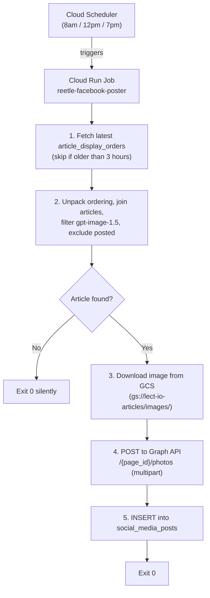

# Facebook Auto-Poster Service

## Architecture



## Step 1 — reetle-models changes (github.com/kauto23/reetle-models)

Add `SocialMediaPost` to the shared models package so it is available to the API and any future services. The model goes in the same `models.py` (or equivalent) alongside `Article`, `ArticleDisplayOrder`, etc.

**Model definition to add:**
```python
from tortoise import fields, models

class SocialMediaPost(models.Model):
    id = fields.IntField(pk=True)
    article = fields.ForeignKeyField("models.Article", related_name="social_media_posts")
    platform = fields.CharField(max_length=50)        # e.g. "facebook"
    posted_at = fields.DatetimeField(auto_now_add=True)
    post_id = fields.CharField(max_length=255, null=True)  # ID returned by Graph API
    metadata = fields.JSONField(null=True)             # page_id, caption, image_url, etc.

    class Meta:
        table = "social_media_posts"
```

**Aerich migration** — run `aerich migrate --name add_social_media_posts` in the reetle-models repo to generate the migration, then commit and tag as `v1.0.1` (or whatever the next version is).

Once tagged, `facebook-poster/requirements.txt` will pin to that tag:
```
reetle-models @ git+https://github.com/kauto23/reetle-models.git@v1.0.1
```

## Step 2 — New files in this workspace

All files created inside `facebook-poster/` — nothing in the existing project is modified.

```
facebook-poster/
├── main.py            # Entry point: async job logic
├── requirements.txt   # Stripped-down dependency list, pinned to new reetle-models tag
├── Dockerfile         # Mirrors parent project pattern
└── cloudbuild.yaml    # Build → push → update/execute Cloud Run Job
```

## Key Design Decisions

**`social_media_posts` table** — lives in `reetle-models` (see Step 1). The `facebook-poster` service imports it from there, same as `Article` and `ArticleDisplayOrder`. No local `models.py` needed.

**Tortoise ORM config** — loads `reetle_models.models` only (all models now there). Connection via `DATABASE_URL` env var, same as parent.

**Article selection** — single raw SQL query via `Tortoise.get_connection("default").execute_query(...)`:

```sql
WITH latest_order AS (
    SELECT ordering, created_at FROM article_display_orders
    ORDER BY created_at DESC LIMIT 1
),
ordered_articles AS (
    SELECT key::int AS position, value::text::int AS article_id
    FROM latest_order, jsonb_each_text(ordering)
)
SELECT oa.position, a.id, a.headline, a.image_url, a.metadata
FROM ordered_articles oa
JOIN articles a ON a.id = oa.article_id
WHERE (SELECT created_at FROM latest_order) > NOW() - INTERVAL '3 hours'
  AND a.metadata->'image_model'->>'model' = 'gpt-image-1.5'
  AND a.id NOT IN (SELECT article_id FROM social_media_posts WHERE platform = 'facebook')
ORDER BY oa.position
LIMIT 1;
```

**Image download** — all `gpt-image-1.5` images are at `gs://lect-io-articles/images/image_{id}.jpeg`. Downloaded as bytes via `google-cloud-storage` client, then uploaded to Facebook using multipart `source` field (no signed URL needed).

**Facebook Graph API call** — `POST /{PAGE_ID}/photos` with:

- `source`: image bytes (multipart)
- `message`: `{headline_es}\n\nImprove your Spanish by reading real news — written for your level.\n\nhttps://reetle.co/?article={id}`
- `access_token`: page access token

**Post format:**

```
{Spanish headline}

Improve your Spanish by reading real news — written for your level.

https://reetle.co/?article={id}
```

**Secrets / environment variables:**

- Local: `.env` file with `FACEBOOK_PAGE_ID`, `FACEBOOK_PAGE_ACCESS_TOKEN`, `DATABASE_URL`, `GOOGLE_APPLICATION_CREDENTIALS`
- Cloud: fetched from Google Secret Manager (secrets named `facebook-page-id`, `facebook-page-access-token`) — same `load_secrets()` pattern as parent, switching on `FLASK_ENV=cloud`

**Deployment** — cloudbuild.yaml mirrors the parent:

1. Docker build with `GITHUB_TOKEN` build arg (for `reetle-models` pip install)
2. Push to `us-docker.pkg.dev/lect-io/lect-io-containers/reetle-facebook-poster`
3. `gcloud run jobs update reetle-facebook-poster ...` (or `create` on first deploy)
4. `gcloud run jobs execute reetle-facebook-poster`

Cloud Scheduler can trigger the job at 8am, 12pm, and 7pm (configured separately).
